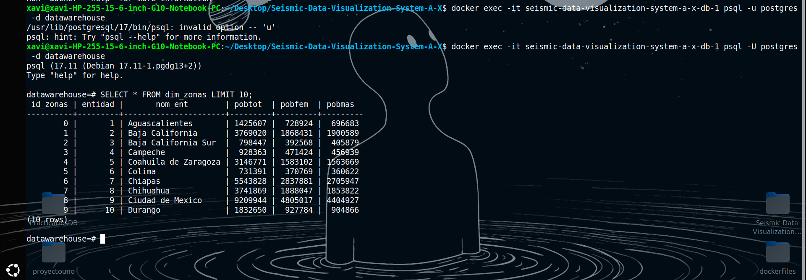
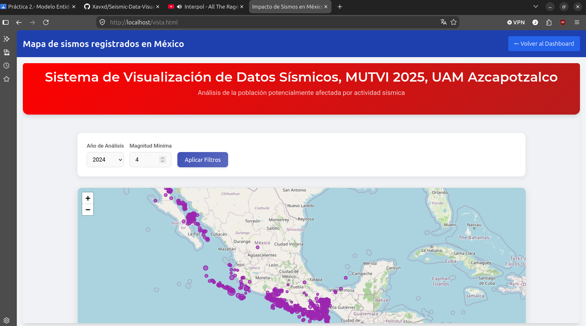
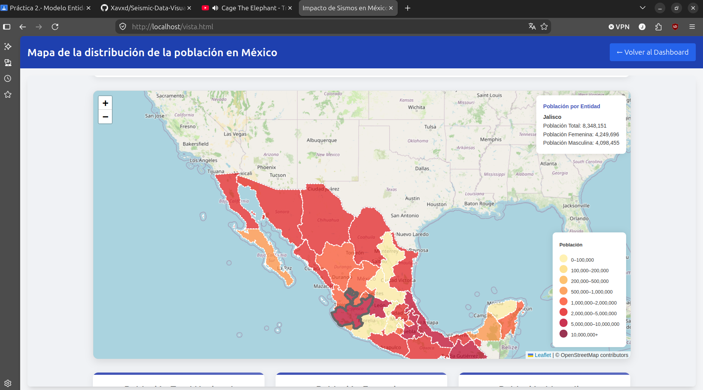
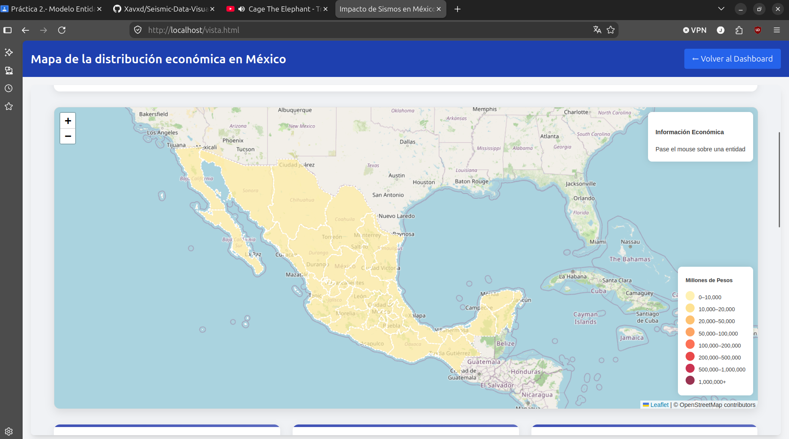

# Seismic Data Visualization System for Mexico

## Description
This project is a copy of the original repository, this copy is created with the goal to learn how fork and clone an original project in Github works.

## Technologies Used
- **PHP**: Server-side scripting language for web development.
- **JavaScript**: Client-side scripting for interactive web features.
- **Docker**: Containerization platform to streamline deployment and management of applications.
- **PostgreSQL**: Open-source relational database for storing seismic data.
- **SSN Data**: Data provided by the Servicio Sismológico Nacional.
- **INEGI Data**: Statistical data provided by the Instituto Nacional de Estadística y Geografía.

## Installation
To get started with this project, follow these instructions:

1. Clone the repository:
   ```first i needed to fork the original repo so i could clone the same from my ow GitHub profile
   bash
   git clone https://github.com/Xavxd/Seismic-Data-Visualization-System-A-X.git
   cd Seismic-Data-Visualization-System-A-X
   ```

2. Build and run the Docker containers:
   ```bash
   docker-compose up -d
   ```

3. Connect to the database in the container:
   - I used the command line docker exec -it <The name of my file> -u <MYuser> -d <DataBaseName>.
   - Once i was conected to the db i did a query and runnig the project in my laptop.  


## Usage
Once the installation was complete I could access to the application using `http://localhost/vista.html` 




## Data Sources
- **Servicio Sismológico Nacional (SSN)**: Provides real-time seismic activity data in Mexico.
- **Instituto Nacional de Estadística y Geografía (INEGI)**: Provides statistical data related to geographical and demographic information.

## License
This project is licensed under the MIT License - see the [LICENSE](LICENSE) file for details.

## Citar este trabajo
Este repositorio es una bifurcacion de el repositorio original:https://github.com/gabrielhuav/Seismic-Data-Visualization-System

- DOI: 10.24275/AZC2026E1004
- Enlace: https://doi.org/10.24275/AZC2026E1004

BibTeX sugerido:

```bibtex
@article{Villa Vargas_Hurtado Avilés_Climent Hernández_2026, title={Cuando México tiembla: la historia contada por los datos}, volume={4}, url={https://azcatl.azc.uam.mx/index.php/azcatl/article/view/75}, DOI={10.24275/AZC2026E1004}, abstractNote={&amp;lt;p&amp;gt;Los sismos son un fenómeno natural impredecible y con un alto impacto. En México, el Servicio Sismológico Nacional genera información detallada de los sismos ocurridos en el país. Aunque valiosa, esta información no siempre es fácil de comprender debido al nivel técnico. Este trabajo propone un sistema que transforma la información sísmica en representaciones visuales, lo que facilita el análisis; adicionalmente, puede relacionar información sísmica con información demográfica y económica del Instituto Nacional de Estadística y Geografía para realizar análisis más amplios. Para garantizar el acceso a este sistema, se utilizan tecnologías abiertas y distribución libre a todos los usuarios interesados.&amp;lt;span class=&amp;quot;Apple-converted-space&amp;quot;&amp;gt; &amp;lt;/span&amp;gt;&amp;lt;/p&amp;gt;}, number={6}, journal={AZCATL Revista de Divulgación en Ciencias, Ingeniería e Innovación }, author={Villa Vargas, José Manuel and Hurtado Avilés, Gabriel and Climent Hernández, José Antonio}, year={2026}, month={mar.}, pages={28–33} }
```
